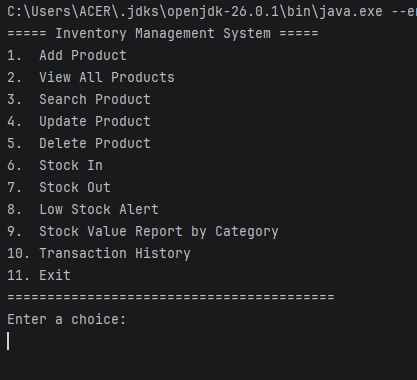
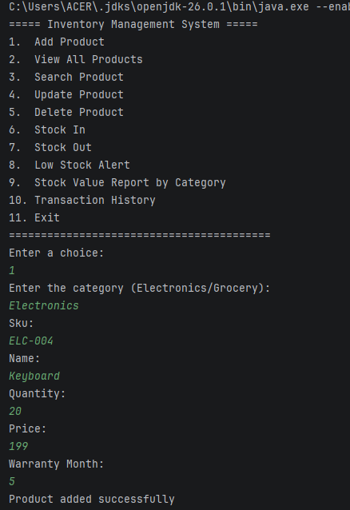
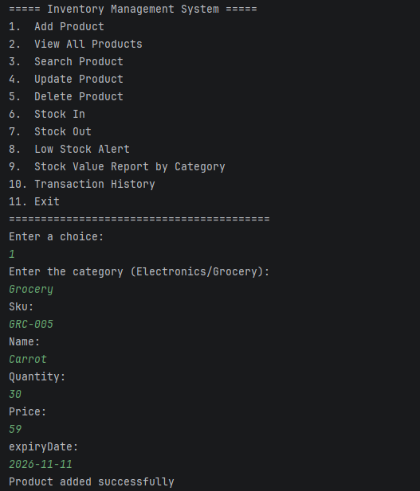
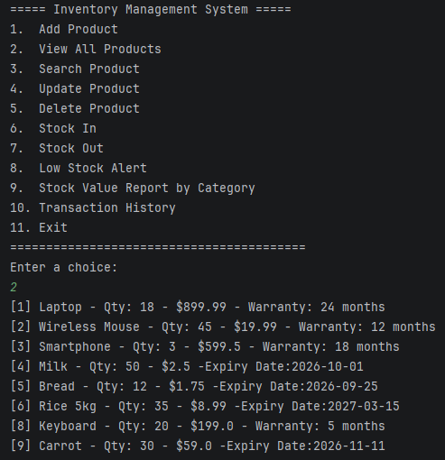
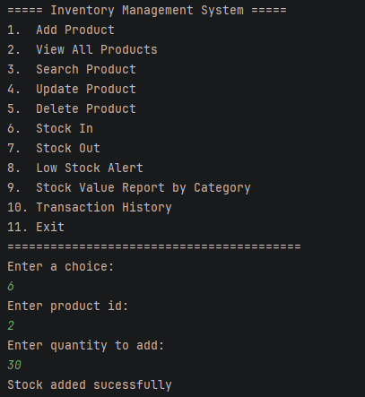
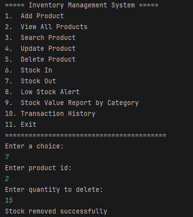
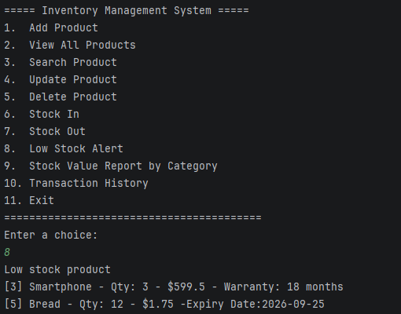
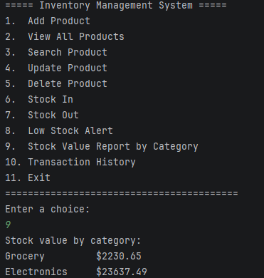
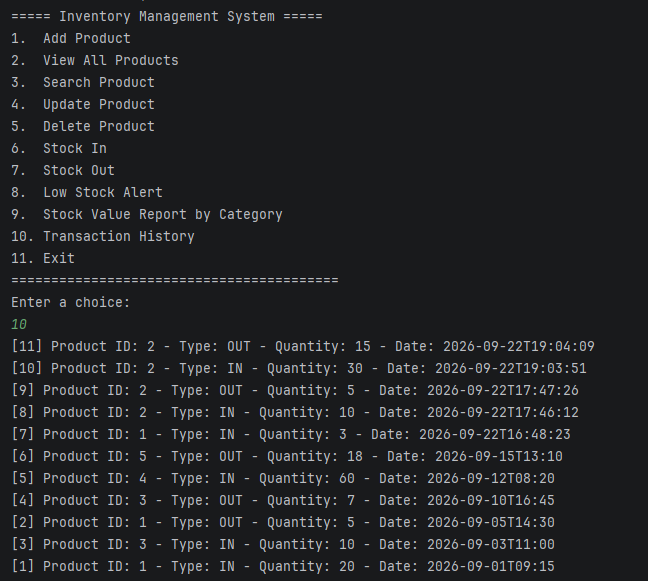

# Inventory Management System

## Project Description

The **Inventory Management System** is a Java-based console application developed to manage products, stock quantities, stock movements, and transaction records. The system uses **MySQL** as the database and **JDBC** for database connectivity, while applying object-oriented programming concepts such as abstraction, inheritance, polymorphism, exception handling, and the DAO/service architecture.

The system supports two product categories: **Electronics** and **Grocery**, with category-specific information such as warranty period and expiry date.

---

# Features Implemented

The following features have been implemented in the system:

### 1. Add Product

* Add Electronics products.
* Add Grocery products.
* Store product SKU, name, quantity, price, and category.
* Electronics products include warranty information.
* Grocery products include expiry date information.

### 2. View All Products

* Display all products stored in the database.
* Product information is retrieved using JDBC and displayed through the console.

### 3. Search Product

* Search for a product using its ID.
* Search for a product using its SKU.
* Displays an appropriate error message when the product does not exist.

### 4. Update Product

* Update product information using the product ID.
* Product price and other supported product information can be modified.

### 5. Delete Product

* Delete a product from the inventory.
* The system confirms whether the requested product exists before displaying the result.

### 6. Stock In

* Increase the quantity of an existing product.
* Automatically record the stock-in operation.
* Store the transaction type as `IN`.

### 7. Stock Out

* Decrease the quantity of an existing product.
* Prevent stock quantities from becoming negative.
* Check whether sufficient stock is available.
* Throw an `InsufficientStockException` when the requested quantity is greater than the available quantity.
* Record the stock-out operation as an `OUT` transaction.

### 8. Low Stock Alert

* Identify products that have fallen below their restock threshold.
* Electronics have a restock threshold of **5**.
* Grocery products have a restock threshold of **20**.

### 9. Stock Value Report by Category

* Calculate the total value of inventory for each category.
* Stock value is calculated using:

```text
Stock Value = Quantity × Price
```

### 10. Transaction History

* Display stock-in and stock-out transactions.
* Display transaction details including product ID, transaction type, quantity, and transaction date.

### 11. Input Validation

* Validate integer input.
* Validate positive quantities.
* Validate positive prices.
* Prevent empty product names.
* Prevent empty SKUs.
* Handle invalid menu choices.

### 12. Exception Handling

The application includes custom exception handling using:

* `ProductNotFoundException`
* `InsufficientStockException`

It also handles input-related exceptions such as:

* `InputMismatchException`
* `IllegalArgumentException`

---

# Technologies and Libraries Used

| Technology               | Version / Details       |
| ------------------------ | ----------------------- |
| Programming Language     | Java                    |
| Java Version             | Java 26                 |
| Build Tool               | Apache Maven            |
| Database                 | MySQL                   |
| Database Connectivity    | JDBC                    |
| JDBC Driver              | MySQL Connector/J 9.4.0 |
| IDE                      | IntelliJ IDEA           |
| Database Management Tool | MySQL Workbench         |

## Main Java Concepts Used

The project demonstrates:

* Classes and Objects
* Encapsulation
* Abstraction
* Inheritance
* Polymorphism
* Interfaces
* Exception Handling
* Collections
* Generics
* JDBC
* Prepared Statements
* Try-with-resources
* DAO Pattern
* Service Layer
* File-based database configuration

---

# Project Structure

```text
Inventory_Management_System/
│
├── pom.xml
├── README.md
│
└── src/
    └── main/
        ├── java/
        │   └── org/
        │       └── example/
        │           │
        │           ├── Main.java
        │           │
        │           ├── dao/
        │           │   ├── ProductDAO.java
        │           │   ├── ProductDAOInterface.java
        │           │   └── TransactionDAO.java
        │           │
        │           ├── exception/
        │           │   ├── InsufficientStockException.java
        │           │   └── ProductNotFoundException.java
        │           │
        │           ├── model/
        │           │   ├── Product.java
        │           │   ├── Electronics.java
        │           │   ├── Grocery.java
        │           │   └── StockTransaction.java
        │           │
        │           ├── service/
        │           │   └── InventoryService.java
        │           │
        │           └── util/
        │               └── DBConnection.java
        │
        └── resources/
            └── db.properties
```

---

# Database Setup

The application uses a MySQL database named:

```text
inventory_management_system
```

## Step 1: Create the Database

Open **MySQL Workbench** and execute:

```sql
CREATE DATABASE inventory_management_system;
```

Select the database:

```sql
USE inventory_management_system;
```

---

# Database Schema

## Products Table

Create the `products` table using the following SQL:

```sql
CREATE TABLE products (
    id INT AUTO_INCREMENT PRIMARY KEY,
    sku VARCHAR(50) NOT NULL UNIQUE,
    name VARCHAR(100) NOT NULL,
    quantity INT NOT NULL,
    price DECIMAL(10,2) NOT NULL,
    category VARCHAR(50) NOT NULL,
    warranty_months INT NULL,
    expiry_date DATE NULL
);
```

### Products Table Structure

| Column            | Data Type     | Description                     |
| ----------------- | ------------- | ------------------------------- |
| `id`              | INT           | Unique product ID               |
| `sku`             | VARCHAR(50)   | Unique Stock Keeping Unit       |
| `name`            | VARCHAR(100)  | Product name                    |
| `quantity`        | INT           | Current stock quantity          |
| `price`           | DECIMAL(10,2) | Product price                   |
| `category`        | VARCHAR(50)   | Product category                |
| `warranty_months` | INT           | Warranty period for Electronics |
| `expiry_date`     | DATE          | Expiry date for Grocery         |

For Electronics products:

```text
warranty_months = applicable value
expiry_date = NULL
```

For Grocery products:

```text
warranty_months = NULL
expiry_date = applicable date
```

---

## Stock Transactions Table

Create the `stock_transactions` table using:

```sql
CREATE TABLE stock_transactions (
    id INT AUTO_INCREMENT PRIMARY KEY,
    product_id INT NOT NULL,
    type VARCHAR(10) NOT NULL,
    quantity INT NOT NULL,
    transaction_date TIMESTAMP DEFAULT CURRENT_TIMESTAMP,
    FOREIGN KEY (product_id) REFERENCES products(id)
);
```

### Stock Transactions Table Structure

| Column             | Data Type   | Description                     |
| ------------------ | ----------- | ------------------------------- |
| `id`               | INT         | Unique transaction ID           |
| `product_id`       | INT         | ID of the related product       |
| `type`             | VARCHAR(10) | Transaction type: `IN` or `OUT` |
| `quantity`         | INT         | Quantity added or removed       |
| `transaction_date` | TIMESTAMP   | Date and time of transaction    |

---

# Complete Database SQL Script

The complete database setup can be performed using the following script:

```sql
CREATE DATABASE inventory_management_system;

USE inventory_management_system;

CREATE TABLE products (
    id INT AUTO_INCREMENT PRIMARY KEY,
    sku VARCHAR(50) NOT NULL UNIQUE,
    name VARCHAR(100) NOT NULL,
    quantity INT NOT NULL,
    price DECIMAL(10,2) NOT NULL,
    category VARCHAR(50) NOT NULL,
    warranty_months INT NULL,
    expiry_date DATE NULL
);

CREATE TABLE stock_transactions (
    id INT AUTO_INCREMENT PRIMARY KEY,
    product_id INT NOT NULL,
    type VARCHAR(10) NOT NULL,
    quantity INT NOT NULL,
    transaction_date TIMESTAMP DEFAULT CURRENT_TIMESTAMP,
    FOREIGN KEY (product_id) REFERENCES products(id)
);
```

---

# Database Configuration

The database connection information is stored in:

```text
src/main/resources/db.properties
```

The file should contain:

```properties
db.url=jdbc:mysql://localhost:3306/inventory_management_system
db.username=root
db.password=YOUR_MYSQL_PASSWORD
```

Replace:

```text
YOUR_MYSQL_PASSWORD
```

with the password of your local MySQL `root` account.

**Important:** Do not upload your real database password to a public GitHub repository.

---

# Maven Configuration

The project uses Maven to manage dependencies.

The MySQL JDBC driver used by the project is:

```xml
<dependency>
    <groupId>com.mysql</groupId>
    <artifactId>mysql-connector-j</artifactId>
    <version>9.4.0</version>
</dependency>
```

Maven automatically downloads the required JDBC driver when the project dependencies are loaded.

---

# Setup Instructions

## Prerequisites

The following software is required:

* Java JDK 26
* IntelliJ IDEA
* MySQL Server
* MySQL Workbench
* Apache Maven

---

## Step 1: Open the Project

Open the project in IntelliJ IDEA.

The project root should contain:

```text
pom.xml
README.md
src/
```

---

## Step 2: Configure MySQL

Start the MySQL Server.

Open MySQL Workbench and run the database SQL script provided above.

Make sure the database exists:

```text
inventory_management_system
```

---

## Step 3: Configure Database Credentials

Open:

```text
src/main/resources/db.properties
```

Update the MySQL credentials:

```properties
db.url=jdbc:mysql://localhost:3306/inventory_management_system
db.username=root
db.password=YOUR_MYSQL_PASSWORD
```

---

## Step 4: Load Maven Dependencies

Open the Maven panel in IntelliJ IDEA and reload the Maven project.

Maven will download the MySQL Connector/J dependency automatically.

---

## Step 5: Verify Java Installation

Open a terminal and run:

```bash
java -version
```

The project requires Java 26.

You can also verify Maven:

```bash
mvn -version
```

---

# Running the Application

## Running Through IntelliJ IDEA

Open:

```text
src/main/java/org/example/Main.java
```

Run the `main()` method.

The application will display the inventory management menu in the terminal.

Example:

```text
=========================================
       INVENTORY MANAGEMENT SYSTEM
=========================================

1. Add Product
2. View All Products
3. Search Product
4. Update Product
5. Delete Product
6. Stock In
7. Stock Out
8. Low Stock Alert
9. Stock Value Report by Category
10. Transaction History
11. Exit
```

---

# Running Using Maven

From the project root directory, compile the project using:

```bash
mvn clean compile
```

After successful compilation, the application can be run from IntelliJ IDEA using the `Main` class.

---

# Application Menu

The application provides the following menu options:

```text
1. Add Product
2. View All Products
3. Search Product
4. Update Product
5. Delete Product
6. Stock In
7. Stock Out
8. Low Stock Alert
9. Stock Value Report by Category
10. Transaction History
11. Exit
```

---

# Application Screenshots

The following screenshots demonstrate the terminal application running.

> **Replace the screenshot placeholders below with your actual screenshots before submission.**

---

## Screenshot 1 – Main Menu

This screenshot should show the application successfully starting and displaying the main menu.




## Screenshot 2 – Adding and Viewing Products

This screenshot should demonstrate products being added and/or displayed.







## Screenshot 3 – Stock Management / Reports

This screenshot should demonstrate one or more inventory operations.











# Object-Oriented Programming Design

The project applies several object-oriented programming principles.

## Abstraction

`Product` is an abstract class that contains common properties and behavior shared by different product types.

The class defines the restock threshold behavior for subclasses.

---

## Inheritance

The system contains two product subclasses:

```text
             Product
                |
        -----------------
        |               |
   Electronics       Grocery
```

`Electronics` and `Grocery` inherit common product information from `Product`.

---

## Polymorphism

The application uses the parent `Product` type to work with different product subclasses.

For example, both:

```text
Electronics
Grocery
```

can be handled as:

```text
Product
```

This allows the DAO and service layers to work with different product types without duplicating common logic.

---

## Encapsulation

Product attributes are maintained through private fields and accessed using getters and setters.

This prevents direct modification of object data and keeps the internal state controlled.

---

# DAO Architecture

The project uses the **Data Access Object (DAO)** pattern to separate database operations from the rest of the application.

The main DAO components are:

### ProductDAOInterface

Defines the operations that can be performed on products.

### ProductDAO

Implements database operations for products using JDBC and prepared statements.

### TransactionDAO

Handles database operations related to stock transactions.

---

# Service Layer

The `InventoryService` class contains the main inventory business logic.

It handles:

* Stock In
* Stock Out
* Low Stock detection
* Stock value calculation
* Product lookup
* Sorting products by stock value

This keeps business logic separate from the console interface and database access code.

---

# Exception Handling

The system includes custom exceptions to handle application-specific errors.

## ProductNotFoundException

This exception is used when a requested product cannot be found in the database.

Example situations:

```text
Searching for a non-existing product ID
Searching for a non-existing SKU
```

---

## InsufficientStockException

This exception is used when a user attempts to remove more stock than is currently available.

For example:

```text
Available stock: 5
Requested stock out: 10
```

The application prevents the operation and displays an appropriate error message.

---

# Stock Management

## Stock In

When stock is added:

```text
New Quantity = Current Quantity + Added Quantity
```

A corresponding `IN` transaction is recorded.

---

## Stock Out

When stock is removed:

```text
New Quantity = Current Quantity - Removed Quantity
```

The system first checks whether sufficient stock exists.

If the requested quantity is greater than the available quantity, the operation is rejected.

A corresponding `OUT` transaction is recorded after a successful stock-out operation.

---

# Low Stock Management

Each product category has a different restock threshold.

| Category    | Restock Threshold |
| ----------- | ----------------: |
| Electronics |                 5 |
| Grocery     |                20 |

A product is considered low stock when:

```text
Current Quantity < Restock Threshold
```

The system displays the products that require restocking.

---

# Stock Value Report

The system calculates inventory value using:

```text
Stock Value = Quantity × Price
```

The values are then grouped by product category.

Example:

```text
Electronics: $2999.98
Grocery:     $450.00
```

The actual values depend on the products stored in the database.

---

# Transaction History

Every successful stock movement creates a transaction record.

Transaction types are:

```text
IN
OUT
```

Each transaction stores:

* Transaction ID
* Product ID
* Transaction type
* Quantity
* Transaction date

This allows the system to maintain a history of inventory movements.

---

# Security and Database Practices

The application uses **PreparedStatement** for database operations instead of directly concatenating user input into SQL statements.

This helps reduce the risk of SQL injection and provides safer database interaction.

The application also uses **try-with-resources** for database resources where applicable so that connections and statements can be properly closed.

---

# Known Limitations

The current version has the following limitations:

1. The application is console-based and does not have a graphical user interface.

2. The system currently supports two product categories:

    * Electronics
    * Grocery

3. The application does not currently include user authentication or role-based access control.

4. Database credentials are stored in the local `db.properties` file. A production system should use environment variables or another secure secrets-management approach.

5. The application requires a locally running MySQL server.

6. The system does not currently include an automated unit testing framework.

7. Product management functionality is designed for the requirements of this coursework and may not include every feature required by a production inventory system.

---

# Future Improvements

Possible future improvements include:

* Implementing a graphical user interface.
* Developing a web-based version of the system.
* Adding user authentication.
* Adding administrator and staff roles.
* Supporting additional product categories.
* Adding complete product editing functionality.
* Adding automated unit and integration tests.
* Adding advanced inventory reports.
* Adding search and filtering options.
* Adding export functionality for reports.
* Improving database transaction management.
* Moving database credentials to environment variables.
* Adding product deletion confirmation.

---

# Conclusion

The Inventory Management System demonstrates how Java, JDBC, Maven, and MySQL can be combined to create a database-driven console application. The project applies object-oriented programming principles, the DAO pattern, a service layer, custom exception handling, database operations using prepared statements, and inventory management functionality.

The application provides a structured way to manage products, monitor stock levels, record inventory movements, and generate basic inventory value reports.

---

# Author

**Inventory Management System**

Developed as a Java database programming project using:

* Java
* JDBC
* MySQL
* Maven
* IntelliJ IDEA
